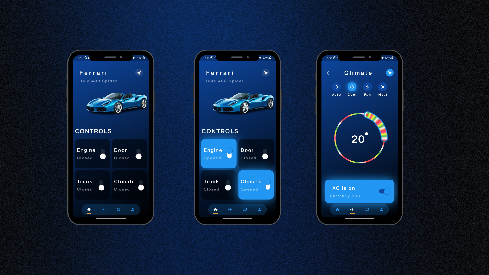

# Car Control Dashboard - Flutter App

Car Control Dashboard is a user-friendly mobile application built using Flutter and powered by GetX for efficient state management. Enjoy a modern and intuitive design that adapts to various screen sizes, providing a seamless experience for controlling your car's features. Interact with dynamic car controls, including speed, steering, and temperature. Realistic animations enhance the visual appeal, making it feel like you are controlling a real car!
## Screenshots

